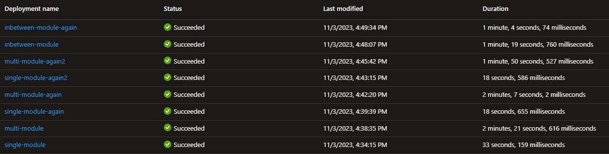

# Bicep module nesting comparison

`single-mnodule` deploys a resource group + storage account, using only 1 module for the storage account scope.

`multi-module` deploys a resource group + storage account, using 6 layers of modules, to compare the deployment duration.

`inbetween-module` deploys a resource group + storage account, using 3 layers of modules, to compare the deployment duration.

### Result:
